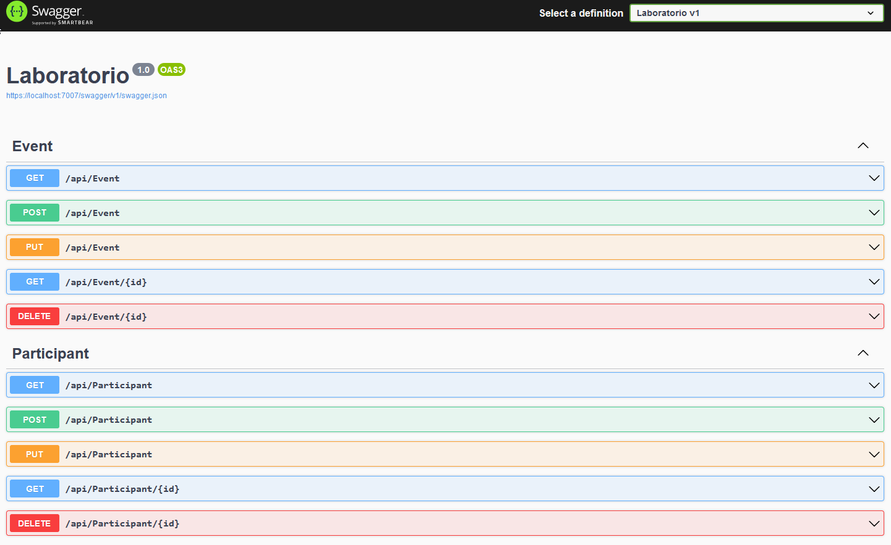

# Bootcamp Backend Continuo - [Relacional] Laboratorio Modulo 2 - Api Rest

Crear los siguientes endpoints para la gestión de las entidades.

## Eventos
- GET /api/eventos: Obtener todos los eventos.
- GET /api/eventos/{id}: Obtener un evento por su Id.
- POST /api/eventos: Crear un nuevo evento.
- PUT /api/eventos/{id}: Actualizar un evento existente.
- DELETE /api/eventos/{id}: Eliminar un evento existente.
## Participantes
- GET /api/participantes: Obtener todos los participantes.
- GET /api/participantes/{id}: Obtener un participante por su Id.
- POST /api/participantes: Crear un nuevo participante.
- PUT /api/participantes/{id}: Actualizar un participante existente.
- DELETE /api/participantes/{id}: Eliminar un participante existente.

## Screenshots

## Tabla participantes

## Tabla Eventos

## Example EndPoint Participants

